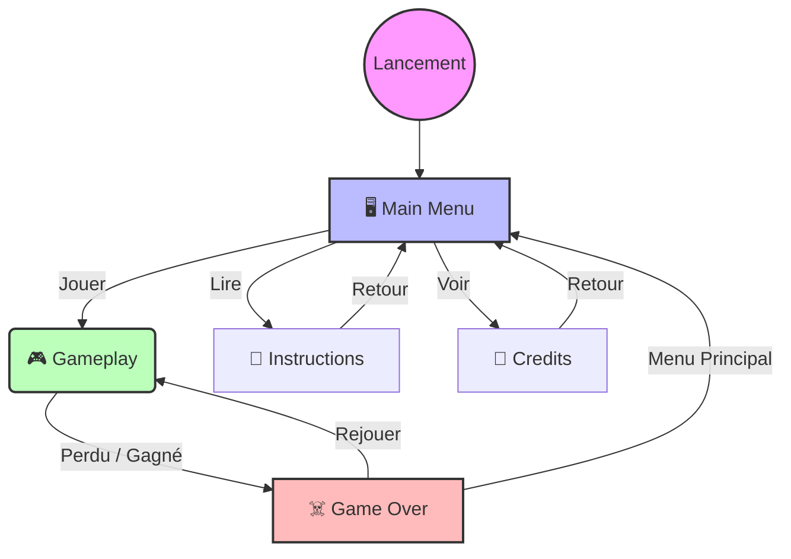

# DEEP HYPNOTICA PROJECT

 Project by Zoléni Kokolo Zassi

## Welcome to my first project in video game

I always wanted to  create my first video game. My prototype was created with Pygame.
This is the version 4.0.0 with a better software development.

I wanted to improve my refactoring on this project before adding new features.

## 📂 Architecture du Projet

Le code est structuré de manière modulaire pour séparer la logique de jeu, les ressources et la configuration.

```text
📦 Arborescence CODE du projet : version_v4
.
├── assets/              # Ressources (Images, Sons, Polices)
├── game/
│   ├── components/      # Entités du jeu (Sprites, UI)
│   ├── config/          # Paramètres et outils globaux
│   ├── constants/       # Variables constantes (Couleurs, Dimensions)
│   ├── core/            # Logique des états (Menu, Jeu, Credits)
│   └── game.py          # Classe principale
├── main.py              # Point d'entrée
└── README.md
```

