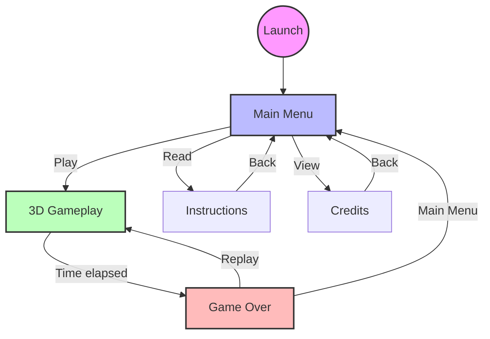

# 🌀 HYPNOTICA

**Project by Zoléni Kokolo Zassi**

My first video game, built with [`pygame-ce`](https://pyga.me/). This version (`version_v4`) is a complete refactor of the original prototype, currently transitioning from a top-down 2D game to a pseudo-3D raycasting game in the style of Wolfenstein 3D.

## ✨ Features

- **Custom raycasting engine** (`game/raycasting_engine/`): DDA ray-by-ray projection, fisheye correction, and distance-based grayscale shading.
- **Smooth frame-rate independent movement** (WASD/ZQSD + arrows), with wall sliding.
- **State machine** driving screen transitions (intro, menu, instructions, game, game over, credits).
- **Centralized audio management** (per-screen music, sound effects) via `Sound`.
- A legacy top-down 2D level (`Level`) remains in the code but is no longer connected to the game — `Level_3D` (raycasting) is the active gameplay.

## 🚀 Installation & Launch

Dependencies are managed with [`uv`](https://docs.astral.sh/uv/) (Python ≥ 3.12).

```bash
uv sync
uv run main.py
```

## 📂 Project Architecture

```text
HYPNOTICA/
├── assets/                    # Images, audio, fonts
├── game/
│   ├── components/            # Sprites & UI for the legacy 2D screen + menu
│   │   ├── constants/          # Layout constants per screen
│   │   ├── elements/           # Button, Satiety, TextScroller
│   │   └── sprites/            # Player/Phone/Background/AllSprites, animated GIF
│   ├── config/                 # Global settings, audio manager, utilities
│   ├── core/
│   │   ├── screens/             # Intro, MainMenu, Instructions, Credits, GameOver, BaseScreen
│   │   └── levels/              # Level (legacy 2D) and Level_3D (raycasting, active)
│   └── raycasting_engine/      # Map, Player, RayCasting (DDA engine)
├── main.py                     # Entry point: Game class (state machine)
└── README.md
```

## 🔄 Game State Machine



## 📜 License

This project is distributed under the [MIT](LICENSE) license.
